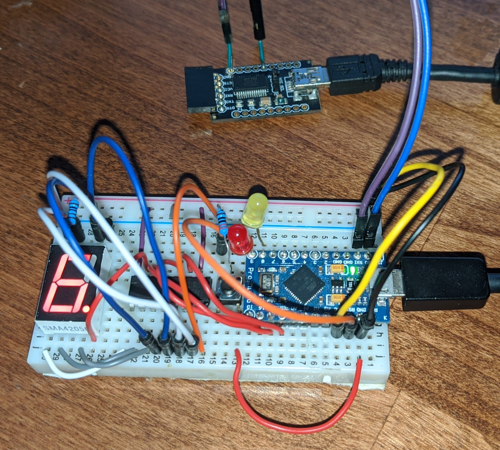

# os32u4
A Kernel for use on 32u4 AVR chips.

This project exists to provide a low-level hardware library to help me program ATmega32u4-based μControllers. Currently, library features include:
 - Digital GPIO
 - Precise & fuzzy timekeeping
 - Timeshare-based multithreading with up to 10 threads 
   - Capibilities for IPC, task management, and freezing threads
   - Easy-to-use interface
   - Low resource usage
 - Support for interacting with 8-bit shift registers
 - Hardware USART with support for redirecting stdio over USART
 - A single-digit 7-segment display driver

All code except `vendor` code has been written by [me](https://retrylife.ca), by hand. I am using this project to help me learn my way arount the AVR ISA.

## Testbed

I am currently developing this library / kernel with the following:
 - Arduino Pro Micro (16mhz 5V)
 - Generic USB-FTDI converter
 - 8bit shift register
 - 7 segment display
 - A few LEDs

## Timers

The following timers are used by os32u4:

| Timer   | Resolution | Usage       |
|---------|------------|-------------|
| `TCCR0` | 8bit       | Timekeeping |
| `TCCR3` | 8bit       | PWM         |

## Documentation

 - [AVRASM2](http://ww1.microchip.com/downloads/en/devicedoc/40001917a.pdf)
 - [32u4 datasheet](http://ww1.microchip.com/downloads/en/devicedoc/atmel-7766-8-bit-avr-atmega16u4-32u4_datasheet.pdf)
 - [Interrupts guide](https://www.avrfreaks.net/sites/default/files/Interrupt.pdf)
 - [avr-libc](https://www.nongnu.org/avr-libc)
 - [32u4 timers](http://medesign.seas.upenn.edu/index.php/Guides/MaEvArM-timers)
 - [Arduino Core](https://github.com/arduino/ArduinoCore-avr)
 - [MCUdude](https://github.com/MCUdude)